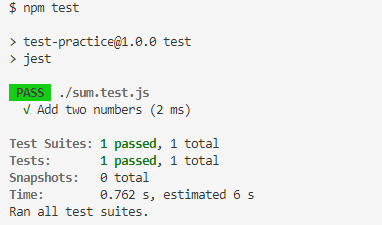

Yesterday, I learned how to do testing. At first, I thought unit testing and A/B testing is similar. It’s not. Unit testing is testing your code to make sure that your code is working for specific functions. Let's say you want to test for the sum function. Then, you can test the sum function only. On the other hand, A/B testing is testing your product between versions A and B. Let's say what happened if you put your call-to-action button on the left instead of the center? Which one shows the best performance? This is a kind of A/B testing.

> Unit testing is testing your code to make sure that your code is working for specific functions. A/B testing is testing your product between versions A and B.

After knowing the difference, I realized what I want to learn for now is unit testing. I learn how to do unit testing using Jest. Jest is a JavaScript testing framework.
You can do testing almost for every framework. [You can read in their doc](https://jestjs.io/). However, right now I'm gonna go with the basics (without any framework).

## Preparations 

I'm using VS Code as my IDE. Already have npm installed. A clear mind for absorbing new information. [FYI: I'm feeling a bit afraid of knowing nothing. To convince me that it's okay to not understand on the first try].

## The Process

I read their doc and follow their [getting started section](https://jestjs.io/docs/getting-started). Everything was smooth. Thus, I try to read the code. There are terms the unfamiliar to me. 

```js

const sum = require("./sum");

test("Add two numbers", () => {
  expect(sum(1, 2)).toBe(3);
});

```

Here are in my mind:
1. There is the word test before anything else.
1. What does expect mean?
1. What is toBe?

I finally answer my questions after reading the doc carefully. 

1. You need to type a test to test the code. It's like a command line to tell Jest that I want this code to be tested. 
1. Expect is your expectation through the test. 
1. toBe means the results of your expectations.  toBe itself called matchers in Jest. There are tons of matchers that you can use based on your need. 

Another thing that I learned is that add `--coverage` on package.json after Jest in the test section. Here's how it looks:

```
{
    "scripts": {
        "test": "jest --coverage"
    }
}
```

Adding it is helpful for understanding your error. For me, it's more readable. Then, try to run the `npm test`. After that, you will have a folder called `discover`. This is step-by-step on how to open the `index.html` at the `icov-report` folder:

1. Click the `discover` dropdown button. You will have lots of files.
2. Click the `icov-report` dropdown button. Again you will see lots of files. 
3. Find `index.html` then click it.
4. Now, we're in `index.html` file.  Then, open this file in a live server the way you open the HTML file. 

This is how it looks:


The image above shows that there is an error on the `sum.js`. It's clickable. Try to click it. Then, you will see something like this. 


The highlighted line from the picture above indicates the error from the file. Having this kind of tool would be helpful for debugging. 

## Lesson Learned 

It's useful to get to know whether the code works. It gave you confidence that your code it runs well as expected. It looks like this.



If it's failed then you get a clear error message. I think this is where unit testing come in handy. You get the clear text which one codes seems to be an error.  


Testing is based on your command. Let's say you want to test two functions. Then, you write one test. The results show pass and fail. It is passed cause on of your codes works. It's a failure because you don't test your other code. 


At the picture above, look at the uncovered line coloumn. It shows you the number and the file of your code that seems to be an error. Or you can use `--coverage` as I mentioned above.


Overall, that's great learning. Knowing how to test your code is awesome. Jest also provides macthers based on the needs. In my opinion, I need to know how to use those matchers. They are built to make the testing process easier. Implementing it to my code is what's important. I am gonna put this habit into my workflow. 